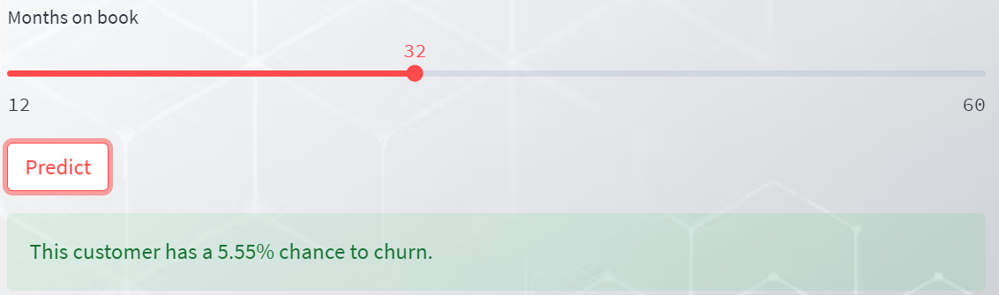

# Customer Churn Prediction App 

This is a Streamlit app (https://bit.ly/churnhalt) for predicting customer churn using an XGBoost binary classification model. The user interface provides sliders and number input boxes for the user to input information such as total transaction count, total transaction amount, total revolving balance, etc. After the user has entered the information and clicks on the "Predict" button, the app displays the probability of the customer churning.

# Model Used
The model used in this app is an XGBoost classifier. It has been pre-trained and loaded from a saved model file. The model takes the user input as a Pandas DataFrame and uses the predict_proba() method to predict the probability of customer churn. 

